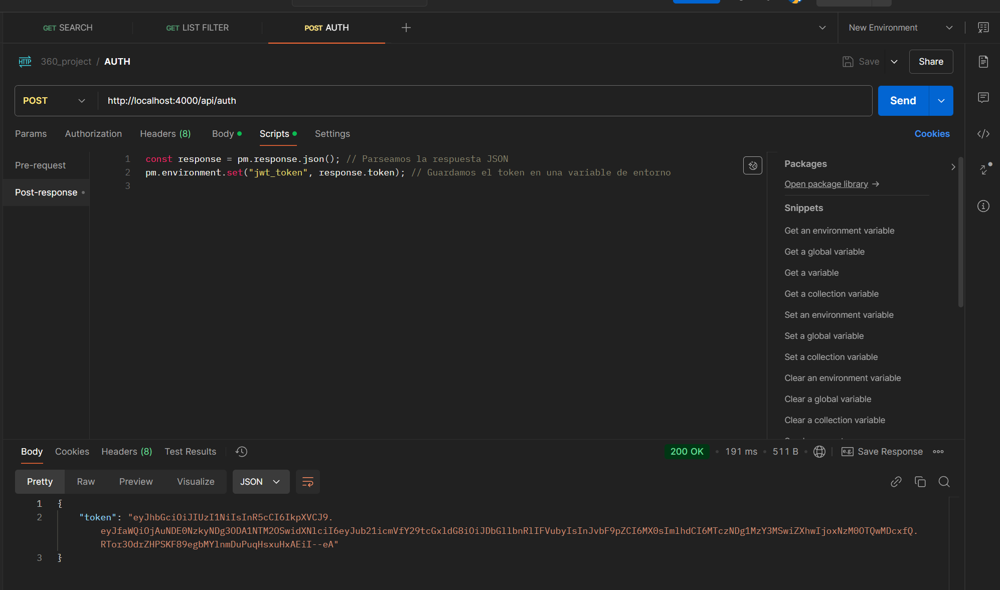

# Proyecto API-REST con Node.js, Express y SQL Server

<p align="center">
   
</p>

## Descripción del Proyecto

Este proyecto consiste en el desarrollo de un API-REST utilizando **Node.js** (v22.12.0), **Express**, y **SQL Server** como base de datos. El objetivo principal es implementar las funcionalidades necesarias para el manejo de productos, categorías, estados, usuarios, órdenes y clientes, cumpliendo con los requerimientos establecidos en el "Reto Segunda Semana".

El proyecto incluye:

- CRUD de diferentes entidades.
- Implementación de seguridad mediante **JSON Web Tokens (JWT)**.
- Gestión de sesiones y validación de transacciones.
- Validación y prueba de los endpoints con **Postman**.
- Publicación del código en un repositorio de **GitHub**.
- Script SQL para la base de datos con registros de prueba.

### Clave de Usuario para el Concurso

- **Clave de aspirante**: GDA00165-OT
- **Grupo de clase**: A

---

## Requisitos Previos

- **Node.js** v22.12.0
- **npm** 11.0.0
- **SQL Server**
- **Postman** para pruebas de endpoints
- Repositorio en **GitHub**

---

## Instalación

1. Clonar el repositorio:

   ```bash
   git clone <URL_DEL_REPOSITORIO>
   cd <NOMBRE_DEL_REPOSITORIO>
   ```

2. Instalar las dependencias del proyecto:

   ```bash
   npm install
   ```

3. Configurar las variables de entorno en un archivo `.env`:

   ```env
      SERVER_PORT=4000

      DB_HOST=localhost
      DB_PORT=1434
      DB_NAME=GDA00165_GT_DANIEL_BAUTISTA
      DB_USER=GDA00165_GT
      DB_PASS=Contrase@nalg_dag123as511

      JWT_SECRET=lkasjksggaj.asdgakak1241?sk5122la
   ```

   Se que lo correcto es no poner estos datos publicos en el respositorio pero para falicitar la calificacion los he colocado aca para que copien y peguen en el .env.
   el **DB_NAME** y **DB_USER** asi como **DB_PASS** son creados por el script de SQL, si hay alugn error, deberan crearlos manualmente, pueden cambiar la contraseña,
   pero el script hardcodea usuarios aletaoriamente y usa esa contraseña para encriptar las contraseñas, deberan a posteriori actualizar esos usuarios.

4. Ejecutar el servidor:

   ```bash
      npm run dev   # invoca al loader de alias
      npm run dev   # invoca al loader de alias
   ```

   Para facilitar los imports, solamente esta usado para produccion, se debe compilar luego para que funcione en produccio

5. Probar los endpoints utilizando Postman.


---

## Dependencias

El proyecto utiliza las siguientes dependencias principales:

- **express**: Framework web para construir la API.
- **jsonwebtoken**: Para la autenticación mediante JWT.
- **bcryptjs**: Para el hash de contraseñas.
- **cors**: Para permitir solicitudes de diferentes orígenes.
- **cors**: Para permitir solicitudes de diferentes orígenes.
- **dotenv**: Para la gestión de variables de entorno.
- **esm-module-alias**: Para facilitar la importación de módulos.
- **path**: Para trabajar con rutas de archivos y directorios.
- **process**: Para gestionar procesos y variables de entorno.
- **sequelize**: ORM para interactuar con bases de datos SQL.
- **tedious**: Conector para interactuar con SQL Server.

Instalar todas las dependencias usando:

```bash
npm install


```

---

## Funcionalidad

### Endpoints CRUD

1. **Productos**

   - Crear, actualizar, eliminar y listar productos.

2. **Categorías de Productos**

   - CRUD completo para las categorías.

3. **Estados**

   - Gestión de estados de productos o pedidos.

4. **Usuarios**

   - CRUD con encriptación de contraseñas.

5. **Orden y Detalles**

   - CRUD maestro-detalle para la gestión de órdenes y sus detalles.

6. **Clientes**
   - Gestión completa de los datos de clientes.

... verificar el archivo **360_project.postman_collection.json** para conocer todos los endpoints

---

### Seguridad

1. **Autenticación con JWT**

   - Generación de tokens al iniciar sesión.
   - Validación de cada solicitud con un token válido.
   - Expiración de tokens en 24 horas.

2. **Gestión de Sesiones**
   - Control de inicio y cierre de sesión para los usuarios. : NO IMPLEMENTADO AUN

---

## Pruebas

- Utilizar **Postman** para probar cada uno de los endpoints.
- Validar que las operaciones CRUD y la autenticación funcionen correctamente.
- Verificar el manejo de errores y las respuestas del servidor.
- Crear un **enviroment** en postman, puest dosas las solicitudes wardan el token en una variable de entorno
- Se uso autenticacion por baerier en los testeos de postman, sin embargo si devuelve el token el API
- NO se han implementado roles, por tiempo, pero si se esta pensado, todo esta como controladores, solo es de implementar un middleware para validarlo

---

## Publicación y Scripts

- Subir el proyecto a un repositorio público en **GitHub**.
- Adjuntar el script SQL de la base de datos con datos de prueba.

---

Si tienes alguna duda o sugerencia sobre este proyecto, ¡no dudes en comunicarte! 😊

---

## Funcionalidad

<p align="center">
   
</p>

**Todos los endpoints testeados se encuentran en la carpeta de /postman para que sean importados.**
**Los endpoints fueron exportados en la versión 2.1 de Postman.**

SIEMPRE se debe iniciar por llamar al API en /auth/ verificar que el script funcione

<p align="center">
   
</p>

Luego puedes llamar a los endpoints, el token se cargara automaticamente

<p align="center">
   
</p>

## Distribucion proyecto
```
D:\
├── .env
├── .gitignore
├── LICENSE
├── package-lock.json
├── package.json
├── README.md
├── server.js
├── doc
│   ├── imgs
│   │   ├── auth.png
│   │   ├── image.png
│   │   └── states_order_lim_off.png
│   ├── postman
│   │   └── 360_project.postman_collection.json
│   ├── sql
│   │   └── GDA00165_GT_DANIEL_BAUTISTA.sql
│   └── .package-lock.json
├── src
│   ├── controllers
│   ├── helpers
│   │   └── auth.helper.js
│   ├── middlewares
│   │   └── auth
│   │       └── auth.middleware.js
│   ├── model
│   │   ├── database
│   │   │   └── sequelize_orm.model.js
│   │   ├── model_states
│   │   │   ├── order_status.dao.js
│   │   │   ├── product_status.dao.js
│   │   │   └── user_status.dao.js
│   │   ├── oders
│   │   │   └── order.dao.js
│   │   ├── product
│   │   │   ├── product.dao.js
│   │   │   └── product_category.dao.js
│   │   ├── user
│   │   │   ├── user.dao.js
│   │   │   └── direction
│   │   │       └── client_direction.dao.js
│   │   └── rol
│   │       ├── rol.dao.js
│   │       └── rol.model.js
│   ├── routes
│   │   ├── routes.js
│   │   ├── auth
│   │   │   └── auth.routes.js
│   │   ├── domain
│   │   │   └── domain.routes.js
│   │   ├── orders
│   │   │   └── order.routes.js
│   │   ├── product
│   │   │   ├── product.routes.js
│   │   │   └── category
│   │   │       └── product_category.routes.js
│   │   ├── users
│   │   │   ├── user.routes.js
│   │   │   └── directions
│   │   │       └── client_direction.routes.js
│   │   ├── rol
│   │   │   └── rol.routes.js
│   │   ├── model_states
│   │   │   └── model_status.routes.js
│   │   └── states
│   │       ├── order_status.routes.js
│   │       ├── product_status.routes.js
│   │       └── user_status.routes.js
│   └── services
│       ├── auth
│       │   └── auth.service.js
│       └── hashing

